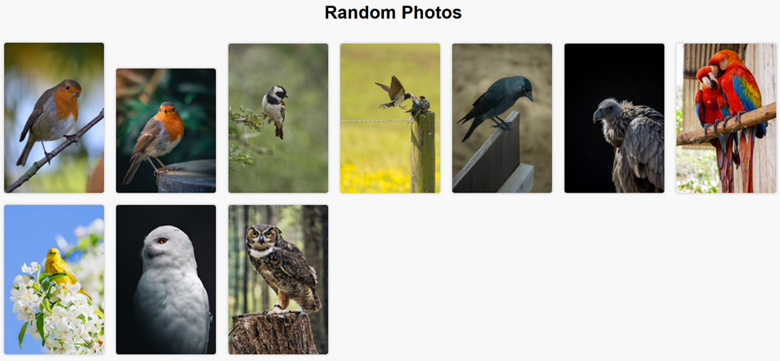
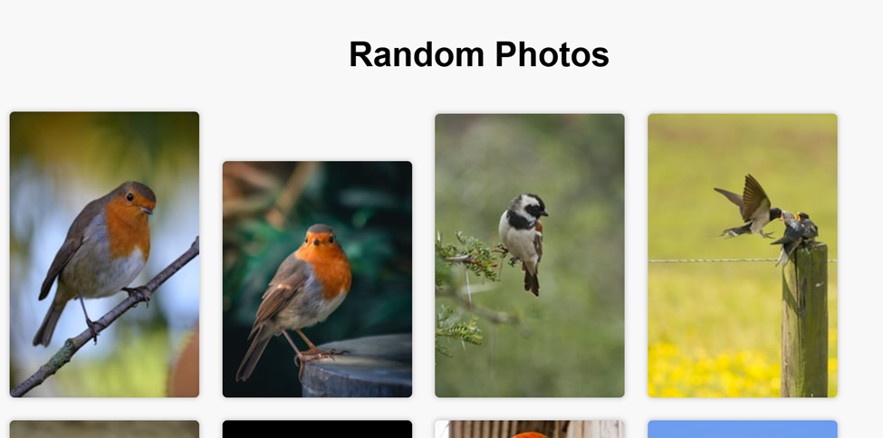
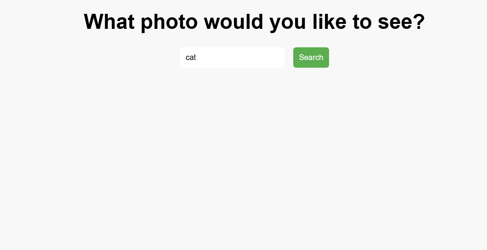
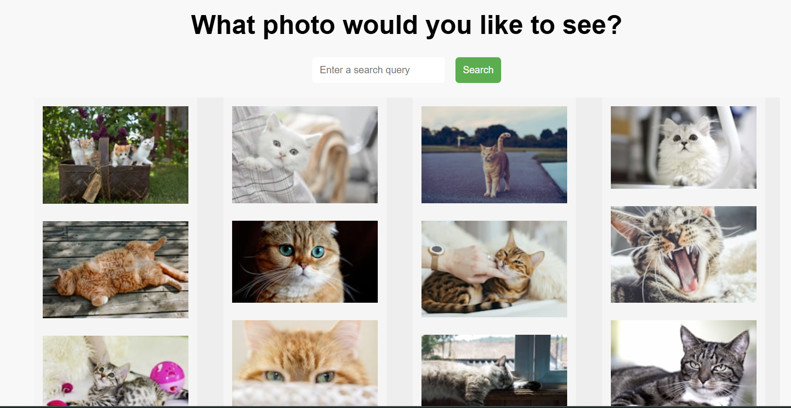
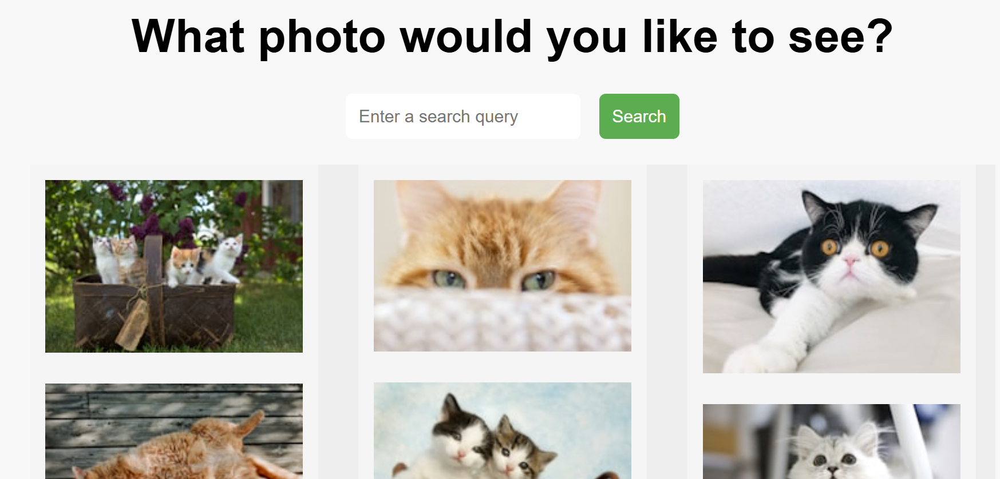

Title: ImageQuest

Purpose:
- To display random photos of birds in a grid format on a webpage
- Or, have the user request images that they'd like to see, and display them in a grid format on a webpage.

Setup: 
- Clone project
- Update unsplash credentials in the scripts you'd like to run, at https://unsplash.com/developers
- Modify path of data file
- Run the DisplayRandomPhotos.py or DisplayAnyPhotos_with_SearchBar.py

Example outputs:
- DisplayRandomPhotos.py
Displays 10 random photos of birds on a webpage. Grid format changes based on screen display.

DisplayAnyPhotos_withSearchBar.py
Requests a user for a photo they’d like to see. Displays 20 photos that relate to the photo type user requested. 

